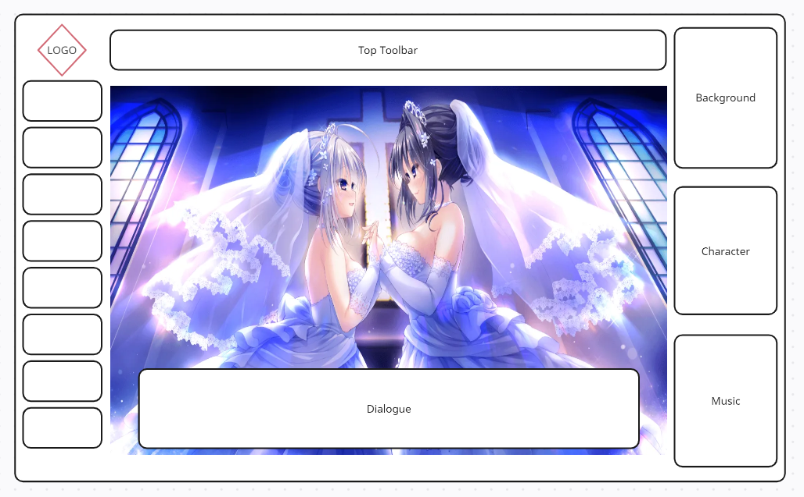
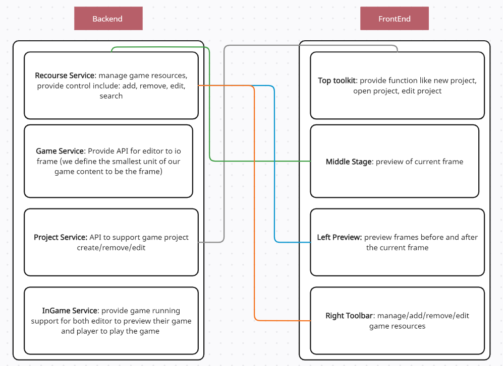

## CS222 Project Proposal Final Draft

### Pitch

Today we have many webpage that supports the job of software like packing and unpacking file,transform `mp3` to `wav` file. We found it is hard to make a visual novel game without pre-installed software on the local computer this far. So an online visual novel game editor would greatly reduce the cost of creating a visual novel game.

### Functionality

1: Users can import the local file and developing process pack into the editor.

2: Users can pack and export the saving developing or developed file into the local.

3: Users can add text, into specific scene by importing file or typing.

4: Users can combine chatbox, character, sound, background into a scene.

5: Users can assign the sequence of scene to make a plot, if possible make different branch.

6: Users can edit character's animation in specific scene and the movement of camera

### Components

#### Backend

We will write the backend by using python with the fastapi framework. The reason we choose it is because all of our team member know how to coding in Python, and two of them have experience in building website (backend + frontend) by using web framework in Python. For our project, we do not need a lot of api but just some standard file io function. Hence, we choose to use `fastapi` as it can satisfied our requirement and can implement in a relatively fast way. The duty of the backend service is to provide our frontend a simpler way to manage the game resources, in our later iteration, we also plan to add a game save/load function in the executable file, which may require the backend write a simple PDO. All in all, our backend has following duty:

+ file IO: add, delete, modification, fetch
+ game memory PDO

Most part of our backend is based on python, hence, we choose to use [Google Styleguild for python](https://google.github.io/styleguide/pyguide.html) because it is not only formal but also robust as it support a python package called `pylint` to check grammar, structure locally. We will also deploy `linter` on our GitHub repo to supervise everyone's code quality so that code quality can get improved.

#### Frontend

the major duty of our project is the frontend development, in order to finish our first demo in a faster way, we choose to use a popular frontend framework: `Vue.js` as it can help us build a usable and pretty page in a comparably short time. Two of our team member have experience in  frontend development--bootstrap, and three of us know how to use JavaScript, so we plan to split the frontend task into four part so it will be easier for us to work together. The specified tasks are shown below:

+ top tool-bar
+ middle preview frame (stage)
+ left smaller preview bracket
+ right toolkit panel

Most of our frontend is based on `Vue.js`, and luckily, this framework has it [own test library](https://testing-library.com/docs/vue-testing-library/intro/) so we choose to use it. For the standard JavaScript code, we will use [`Jest `](https://jestjs.io/) for checking. For the coding standard, we will follow the [Google Styleline for JavaScript](https://google.github.io/styleguide/jsguide.html) and use linter as our remote code checker. 

#### Interact 

In order to interact the frontend and backend code, we make a `API Reference Template` in our repo as a backend API developing standard, and everyone who engage in backend developing will need to follow and fulfill it. For the specific interaction of our backend and frontend, please refer to the diagram below.

#### Workflow

For the work flow, we will have a dedicated time slot to review and push the new code to the main branch at the end of the week.

Every one should be responsible for the file they created, if a file will only be modified by 1 
person, this file can go under the the developing branch(as branch 1) that is modified by all the people.

If the file is developed with 2 or more people at the same time(frontend and backend communication), there should be a sub branch under the 
developing branch created(as branch 1-x), and after finished, this branch should be merged with branch 1. 

Before we start coding, we will make a pull request to make sure that their version of code is up to date. 

Furthermore, we will set up the gitaction for code format check, and run test cases on each commit to prevent code format issue, and 
potential bug that might ruin the future add-on features. 

### Weekly Planning

1. Set up frontend with `Vue.js` and backend with `FastAPI`, set up git repo and introduce basic workflow. Design basic UI features.
2. Allow user to add and delete frame. Only allow linear structure at this point. Allow images upload. Create clickable options to go to the next frame.
3. Allow creating and editing character and their associated text. Allow music upload. Creating UI for toolbar.
4. Allow stoping, inserting, and starting music. Allow the project to be "played". 
5. Allow a project to be saved and loaded in certain format. Continue to optimize UI.
6. Allow the project to be exported as a single executable file. Allow multiple branches following up a frame.
7. Start to create a demo using the editor. Allow the player to save their progress mid game.
8. Finish the demo.

### Potential Risks

1. Given we just learn how to use `Vue.js`, we might make stupid mistakes, or did not use the correct syntax, which might slow down our progress. The time impact will increase about 20% more than our expected time. If this issue occur, we will contact out mentor ASAP, and seeking for help in all available ways. 

2. Since we will use JS extensively, we did not know whether our browser environment can handle the load. If that happen, we will host our project on a external server. Given that we might need to setup the network, file directory, and server configuration, etc. The whole migrate process might take us 2-3 days.

3. We did plan to add extra animation, and other functionality to our project. However, if there is not enough time for us, we will remove these add on functions. To make the add on/remove process faster, we will try our best to modularize our code. 

### Teamwork

Since all of our group members have taken CS225, so we will be use CS225's environment to develop our project. In this way, we can reduce compatible issues to the lowest. 

Our group has 4 people, we distribute the workload based on indivuduals capability. 

`TianYi`, who is good at both frontend and backend, will be the manager. He is able to foreseen the current process, and supervised people working on both front and back end. 

`JinHeng`, who wants work for backend, will focus on editor functions, and potential migration process if occurred. 

`Yiwei`, who is good at backend will also work on the functionality development, and performance enhancement. 

`ZiHao` has a deep understanding, and knowledge on the music and art area, so he will responsible for the coding on art and design.

### Conflict

Conflicts are inevitable when it comes to group project, so we have reach an agreement before the start of the project that everyone has the same decision weight when coming to the conflict. we will ,first, acknowledge the conflicts. The first solution to resolve the conflicts is to have a conversation between both side, and try to resolve the issue(either by persuading another side, or making concessions to reach a common ground). If the conversation failed to resolve the conflicts, we will move on to second solution: voting. By arrange a voting session, we will let the number of votes to decide which idea/way that we will follow. If there is a draw condition on the voting, we will bring the issue to the mentor, and make final decision based on mentor's feedback. 
